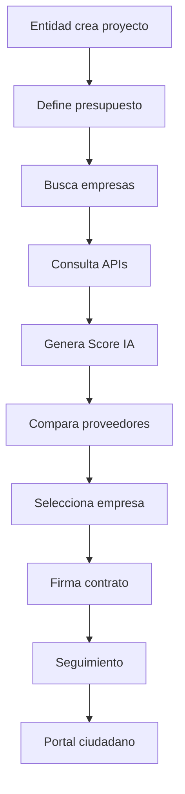
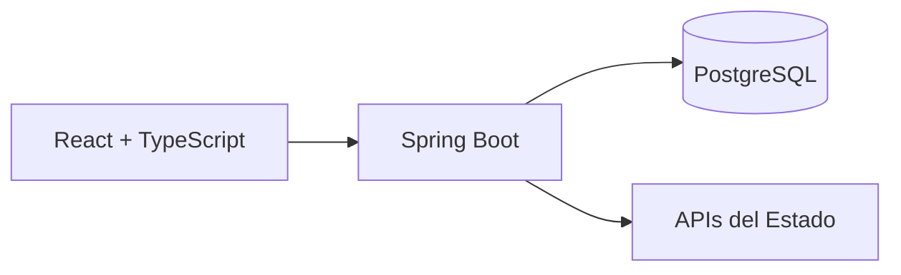

# ContrataIA Perú

> Plataforma para la Gestión, Evaluación y Seguimiento de Contrataciones Públicas y Privadas

**Eslogan:** *"Contrata con confianza. Decide con inteligencia."*

---

# Índice

- Introducción
- Problemática
- Objetivos
- Propuesta de Valor
- Usuarios
- Flujo General
- Arquitectura
- Perfil Inteligente del Proveedor
- Comparador Inteligente
- Gestión Documental
- Seguimiento del Proyecto
- Portal Ciudadano
- APIs
- Seguridad
- Stack Tecnológico
- Roadmap

---

# Introducción

ContrataIA Perú es una plataforma que centraliza la evaluación, selección y seguimiento de proveedores para proyectos públicos y privados.

Actualmente la información se encuentra distribuida entre múltiples plataformas. ContrataIA unifica esos datos, genera indicadores automáticos y utiliza Inteligencia Artificial para asistir la toma de decisiones.

---

# Problemática

```text
               PROCESO ACTUAL

Entidad Pública
      │
      ▼
Buscar proveedor
      │
      ├── SUNAT
      ├── OSCE
      ├── Datos Abiertos
      ├── OEFA
      ├── Expedientes
      └── Excel
      │
      ▼
Comparación Manual
      │
      ▼
Selección
```

## Principales problemas

```
Información dispersa      ████████████████ 90%

Evaluación manual         ██████████████   85%

Seguimiento limitado      ███████████      70%

Transparencia ciudadana   ███████          45%
```

---

# Caso de uso (Ejemplo)

Proyecto:

**Mejoramiento de vías urbanas**

Ubicación:

Lima Metropolitana

Presupuesto:

S/ 12,500,000

Empresas evaluadas

| Empresa | Score IA | Riesgo |
|----------|----------|---------|
| Empresa A | 95 | Bajo |
| Empresa B | 82 | Medio |
| Empresa C | 61 | Alto |

Resultado:

La IA recomienda Empresa A por su mayor experiencia, ausencia de sanciones y mejor cumplimiento histórico.

---

# Flujo General



---

# Arquitectura



---

# Perfil Inteligente del Proveedor

## Información General

- Razón Social
- RUC
- Estado SUNAT
- Antigüedad
- Representante Legal

## Experiencia

- Contratos ejecutados
- Monto contratado
- Rubros
- Regiones

## Indicadores

- Cumplimiento tributario
- Sanciones
- Procesos abiertos
- Tiempo promedio
- Cumplimiento documental

---

## Ejemplo

```
EMPRESA

Constructora Andina SAC

RUC

20123456789

Score IA

95/100

Experiencia

148 contratos

Monto contratado

S/ 487 millones

Cumplimiento

96%

Sanciones

0
```

---

# Comparador Inteligente

| Indicador | Empresa A | Empresa B | Empresa C |
|-----------|-----------|-----------|-----------|
| Experiencia | ⭐⭐⭐⭐⭐ | ⭐⭐⭐ | ⭐⭐⭐⭐ |
| Riesgo | Bajo | Medio | Alto |
| Tiempo | 98% | 81% | 74% |
| Especialización | Excelente | Buena | Regular |

---

# Motor de Inteligencia Artificial

```text
Datos Oficiales
      │
      ▼
Normalización
      │
      ▼
Evaluación
      │
      ▼
Risk Score
      │
      ▼
Recomendación
```

El modelo analiza:

- Especialización
- Historial
- Cumplimiento
- Riesgos
- Experiencia
- Documentación

---

# Gestión Documental

- Bases
- Contratos
- Adendas
- Expedientes
- Fotografías
- Informes
- Firmas Digitales

Todo el contenido queda versionado.

---

# Seguimiento del Proyecto

```text
Proyecto

│

├── Creado

├── Evaluación

├── Empresa Seleccionada

├── Contrato Firmado

├── Inicio

├── 25%

├── 50%

├── 75%

└── Finalizado
```

---

# Portal Ciudadano

Permite:

- Buscar por distrito
- Buscar por código de obra
- Consultar cronograma
- Ver fotografías
- Descargar documentos
- Consultar porcentaje de avance

---

# APIs Integradas

## Estado Peruano

- SEACE
- OSCE
- SUNAT
- OEFA
- Portal Nacional de Datos Abiertos

## Internacionales

- OpenCorporates
- OpenSanctions
- World Bank Open Data

---

# Seguridad

- JWT
- Refresh Tokens
- OAuth2
- BCrypt
- HTTPS
- AES
- RBAC
- Auditoría
- Logs

---

# Stack Tecnológico

Frontend

- React
- TypeScript
- TailwindCSS

Backend

- Spring Boot
- Spring Security
- Spring Data JPA

Base de Datos

- PostgreSQL
- Redis

Infraestructura

- Docker
- GitHub Actions
- Nginx

---

# Roadmap

```
MVP
████████████

Seguimiento
██████████

IA
██████████

Dashboard
████████

Aplicación móvil
██████
```

---

# Beneficios

## Entidades Públicas

- Reduce tiempos
- Centraliza información
- Mejora decisiones

## Empresas

- Mayor visibilidad
- Perfil consolidado

## Ciudadanos

- Transparencia
- Seguimiento público

---


