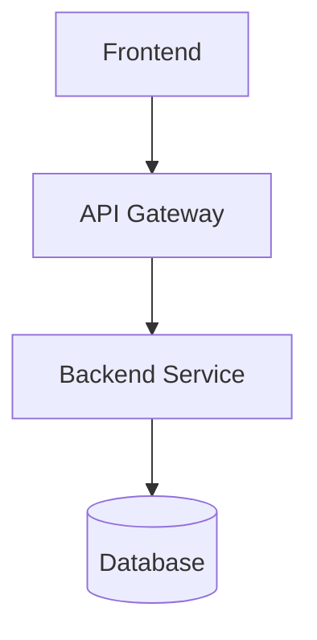

# Documentación Técnica

Esta carpeta contiene la documentación técnica del proyecto.

## Contenido

- `/adr/` - Architecture Decision Records
- Diagramas de arquitectura (Mermaid o PDF)
- Modelos de datos
- Documentación de API

## Formato de Diagramas

Usar Mermaid para que se renderice directamente en GitHub:

