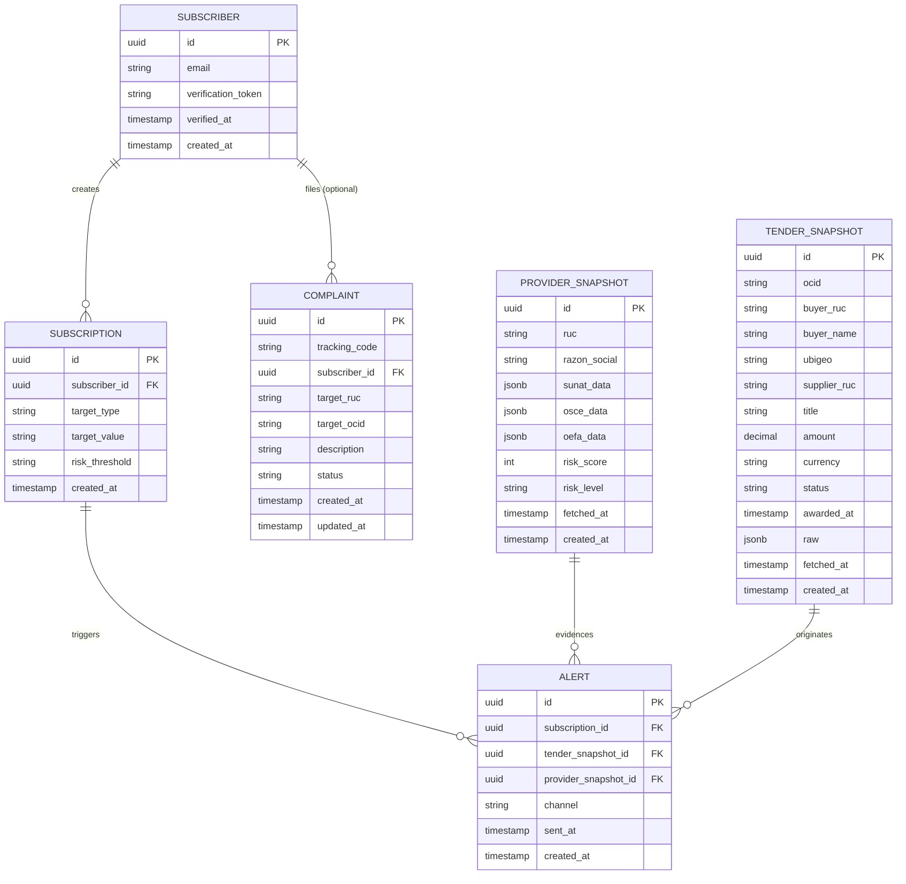

# Modelo de Datos - ContrataIA Perú

> Generado en Sprint 0 a partir de la temática: **Estado Peruano** — Plataforma ciudadana de búsqueda, seguimiento y evaluación de contrataciones públicas (SEACE/OSCE/SUNAT/OEFA) vía API de latinfo.dev.

## Diagrama ERD

## Entidades

### SUBSCRIBER
- **Propósito**: Ciudadano que se suscribe a alertas. Auth passwordless: solo email + token de verificación (magic link). No hay password ni roles.
- **Campos clave**:
  - `email` — único en la práctica; canal de contacto.
  - `verification_token` — token de un solo uso para confirmar el email (magic link).
  - `verified_at` — null hasta que confirma; alertas solo se envían si está verificado. **Campo sensible (PII)**.

### SUBSCRIPTION
- **Propósito**: Qué vigila un suscriptor. Define el filtro que dispara alertas.
- **Campos clave**:
  - `target_type` — enum lógico: `entity` (entidad compradora por RUC), `region` (ubigeo/departamento) o `ruc` (proveedor específico).
  - `target_value` — el identificador del target (RUC, código de región, etc.).
  - `risk_threshold` — enum lógico: `yellow` | `red`. Define el nivel mínimo de riesgo del proveedor adjudicado que dispara la alerta.

### PROVIDER_SNAPSHOT
- **Propósito**: Caché del perfil 360° de un RUC consultado, con red-flags cruzados ya calculados. Evita repegar 6 endpoints de latinfo.dev en cada visita y permite reproducir el semáforo en una alerta.
- **Campos clave**:
  - `ruc` — RUC consultado (solo personas jurídicas, prefijo `20`).
  - `sunat_data` / `osce_data` / `oefa_data` — payloads crudos por fuente (jsonb) para auditabilidad y para no perder información si el ERD evoluciona.
  - `risk_score` — entero 0–100 calculado por el backend.
  - `risk_level` — enum lógico: `green` | `yellow` | `red`. Es el semáforo que ve el ciudadano.
  - `fetched_at` — TTL de caché lo controla `@backend`.

### TENDER_SNAPSHOT
- **Propósito**: Caché de una obra/contrato SEACE consultado o detectado. Es la entidad central del flujo ciudadano: cada obra tiene un `ocid` único que actúa como código público de seguimiento. No replicamos todo SEACE; solo lo consultado o lo que disparó una alerta.
- **Campos clave**:
  - `ocid` — identificador OCDS 1.1 de la licitación (único en la fuente). Es el **código público de la obra**; se puede compartir por URL o QR.
  - `buyer_ruc` — RUC de la entidad pública compradora.
  - `buyer_name` — nombre de la entidad compradora desnormalizado para mostrar en listas sin JOIN ni reparseo del `raw`.
  - `ubigeo` — código de ubigeo del comprador (departamento/provincia/distrito). **Habilita la búsqueda por distrito sin parsear el JSONB en cada query.** Indexado.
  - `supplier_ruc` — RUC del adjudicado, si ya hay award. Puente hacia `provider_snapshot`.
  - `status` — estado OCDS: `planning` | `tender` | `award` | `contract` | `implementation` | `closed`. Alimenta la línea de tiempo pública.
  - `amount` — presupuesto/monto del contrato en `currency`. Se muestra en la página de seguimiento ciudadano.
  - `raw` — payload OCDS completo (jsonb) con todos los hitos y documentos públicos para la línea de tiempo detallada.

### ALERT
- **Propósito**: Registro inmutable de una alerta generada y enviada al suscriptor. Sirve como bitácora y como pantalla "mis alertas" en el dashboard ciudadano.
- **Campos clave**:
  - `subscription_id` — qué suscripción la disparó.
  - `tender_snapshot_id` — licitación que originó la alerta.
  - `provider_snapshot_id` — perfil del proveedor adjudicado en ese momento (snapshot, no live), para que la evidencia del red-flag sea reproducible aunque el riesgo cambie después.
  - `channel` — `email` en el MVP; queda abierto a `webhook`/`sms` a futuro sin migración.
  - `sent_at` — null si está en cola, set cuando se entrega.

### COMPLAINT
- **Propósito**: Canal de denuncia ciudadana con número de seguimiento. Puede ser anónima (sin `subscriber_id`) o ligada a un suscriptor.
- **Campos clave**:
  - `tracking_code` — código corto único entregado al denunciante para consultar estado.
  - `target_ruc` / `target_ocid` — al menos uno debe estar presente (lo valida el backend, no el ERD).
  - `status` — enum lógico: `received` | `in_review` | `resolved` | `dismissed`.
  - `updated_at` — presente porque el estado cambia con el tiempo.

## Relaciones

| Origen             | Destino             | Cardinalidad | Justificación |
|--------------------|---------------------|--------------|---------------|
| SUBSCRIBER         | SUBSCRIPTION        | 1:N          | Un ciudadano puede vigilar varias entidades/regiones/RUCs. |
| SUBSCRIBER         | COMPLAINT           | 1:N (opc.)   | Un suscriptor puede denunciar varias veces; la denuncia también admite anónimos (`subscriber_id` nullable). |
| SUBSCRIPTION       | ALERT               | 1:N          | Cada suscripción puede generar múltiples alertas a lo largo del tiempo. |
| TENDER_SNAPSHOT    | ALERT               | 1:N          | Una misma licitación puede disparar alertas a varios suscriptores que vigilan la misma entidad/región. |
| PROVIDER_SNAPSHOT  | ALERT               | 1:N          | Un proveedor con red-flags puede aparecer en alertas de licitaciones distintas. |

> Nota: `TENDER_SNAPSHOT.supplier_ruc` y `PROVIDER_SNAPSHOT.ruc` se cruzan por valor (string RUC) en tiempo de consulta. **No se modela FK directa** porque ambos son cachés con TTL independiente y un tender puede existir antes de que se haya cacheado el perfil del proveedor.

## Fuera del MVP (futuro)

- **`user_role` / `permission`**: el MVP no distingue tipos de usuario (no hay admin de plataforma en el flujo ciudadano). Se postpone hasta que exista backoffice.
- **`entity_snapshot`** (caché del perfil 360° de la entidad compradora): en el MVP la página de entidad se arma on-the-fly consultando `tender_snapshot` filtrados por `buyer_ruc` + endpoint `/pe/osce/entidades/ruc/{ruc}` sin persistir. Se agregará si el costo de API lo justifica.
- **`audit_log` / `metrics`**: queda fuera; logging operativo va a infra (Vercel/observabilidad), no a la BD de dominio.
- **`alert_delivery_attempt`**: en el MVP `alert.sent_at` es suficiente. Reintentos y bounces se modelarán si el canal email da problemas.
- **`comment` / `vote`** sobre denuncias o licitaciones: fuera de alcance ciudadano del MVP, para evitar moderación.
- **`saved_search`** independiente de suscripción: el MVP unifica "guardar búsqueda" y "suscribirse" en `subscription`.
- **Tabla puente N:M `subscription_alert_channel`**: se posterga porque el MVP solo envía email; el campo `channel` en `alert` basta.
- **Datos PII del denunciante** (nombre, DNI, teléfono): explícitamente fuera por privacidad y por reducir superficie de cumplimiento.
